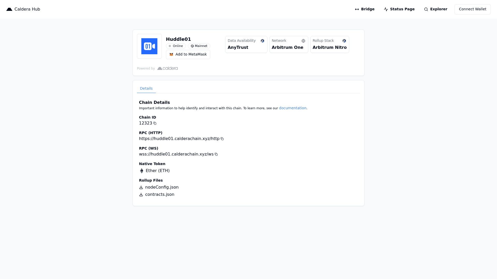

# Add %NETWORK_NAME to Metamask
## Using the %NETWORK_NAME Hub Page
1. Navigate to our [Hub Page](%HUB_URL) 
2. Click the 
**Connect** button in the *Your Wallet* section, and you will be prompted to switch to the %NETWORK_NAME Network

## Manually via Metamask
You can add the network manually via the following details:
- Network Name: %NETWORK_NAME
- RPC URL: %RPC_URL
- Chain ID: %CHAIN_ID
- Currency Symbol: %CURRENCY_SYMBOL
